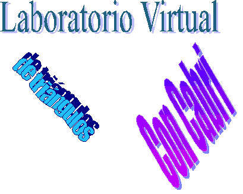

---
# Feel free to add content and custom Front Matter to this file.
# To modify the layout, see https://jekyllrb.com/docs/themes/#overriding-theme-defaults

layout: home
---

  El Laboratorio Virtual de Triángulos con Cabri es una revista on-line de matemáticas dedicada a la resolución de problemas sobre triángulos.

  Está dirigida por Ricardo Barroso Campos, profesor de Didáctica de las Matemáticas de la Universidad de Sevilla. Actualmente es mantenida por Francisco Javier García Capitán profesor de Matemáticas de Instituto.

## Editoriales
<a href="https://trianguloscabri.github.io/editorial060213.html">Editorial 2</a>

## Los 200x
<table>
  <tr>
    <td><big><a href="https://trianguloscabri.github.io/curso20002001/index.htm">Curso 2000/01</a></big> Problemas <em> 1 al 35 </em></td>
    <td><big><a href="https://trianguloscabri.github.io/curso20012002/index.htm">Curso 2001/02</a></big> Problemas <em> 36 al 59 </em></td>
    <td><big><a href="https://trianguloscabri.github.io/curso20022003/index.htm">Curso 2002/03</a></big> Problemas <em> 60 al 110 </em></td>
    <td><big><a href="https://trianguloscabri.github.io/curso20032004/index.htm">Curso 2003/04</a></big> Problemas <em> 111 al 190 </em></td>
    <td><big><a href="https://trianguloscabri.github.io/curso20042005/index.htm">Curso 2004/05</a></big> Problemas <em> 191 al 268 </em></td>
  </tr>
    <tr>
    <td><big><a href="https://trianguloscabri.github.io/curso20052006/index.htm">Curso 2005/06</a></big> Problemas <em> 269 al 330 </em></td>
    <td><big><a href="https://trianguloscabri.github.io/curso20062007/index.htm">Curso 2006/07</a></big> Problemas <em> 331 al 339 </em></td>
    <td><big><a href="https://trianguloscabri.github.io/curso20072008/index.htm">Curso 2007/08</a></big> Problemas <em> 400 al 480 </em></td>
    <td><big><a href="https://trianguloscabri.github.io/curso20082009/index.htm">Curso 2008/09</a></big> Problemas <em> 481 al 516 </em></td>
    <td><big><a href="https://trianguloscabri.github.io/curso20092010/index.htm">Curso 2009/10</a></big> Problemas <em> 517 al 576 </em></td>
  </tr>
</table>

## Los 201x
<table>
  <tr>
    <td><big><a href="https://trianguloscabri.github.io/curso20102011/index.htm">Curso 2010/11</a></big> Problemas <em> 577 al 622 </em></td>
    <td><big><a href="https://trianguloscabri.github.io/curso20112012/index.htm">Curso 2011/12</a></big> Problemas <em> 623 al 657 </em></td>
    <td><big><a href="https://trianguloscabri.github.io/curso20122013/index.htm">Curso 2012/13</a></big> Problemas <em> 658 al 687 </em></td>
    <td><big><a href="https://trianguloscabri.github.io/curso20132014/index.htm">Curso 2013/14</a></big> Problemas <em> 688 al 717 </em></td>
    <td><big><a href="https://trianguloscabri.github.io/curso20142015/index.htm">Curso 2014/15</a></big> Problemas <em> 718 al 740 </em></td>
  </tr>
    <tr>
    <td><big><a href="https://trianguloscabri.github.io/curso20152016/index.htm">Curso 2015/16</a></big> Problemas <em> 741 al 781 </em></td>
    <td><big><a href="https://trianguloscabri.github.io/curso20162017/index.htm">Curso 2016/17</a></big> Problemas <em> 782 al 842 </em></td>
    <td><big><a href="https://trianguloscabri.github.io/curso20172018/index.htm">Curso 2017/18</a></big> Problemas <em> 843 al 884 </em></td>
    <td><big><a href="https://trianguloscabri.github.io/curso20182019/index.htm">Curso 2018/19</a></big> Problemas <em> 885 al 915 </em></td>
    <td><big><a href="https://trianguloscabri.github.io/curso20192020/index.htm">Curso 2019/20</a></big> Problemas <em> 916 al 947 </em></td>
  </tr>
</table>

## Los 202x
<table>
  <tr>
    <td><big><a href="https://trianguloscabri.github.io/curso20102021/index.htm">Curso 2020/21</a></big> Problemas <em> 948 al 1007 </em></td>
    <td><big><a href="https://trianguloscabri.github.io/curso20212022/index.htm">Curso 2021/22</a></big> Problemas <em> 1008 al 1055 </em></td>
    <td><big><a href="https://trianguloscabri.github.io/curso20222023/index.htm">Curso 2022/23</a></big> Problemas <em> 1057 al --- </em></td>
    <td>&nbsp;&nbsp;&nbsp;&nbsp;&nbsp;&nbsp;&nbsp;&nbsp;&nbsp;&nbsp;&nbsp;&nbsp;&nbsp;&nbsp;&nbsp;&nbsp;&nbsp;&nbsp;&nbsp;&nbsp;&nbsp;&nbsp;&nbsp;&nbsp;&nbsp;</td>
    <td>&nbsp;&nbsp;&nbsp;&nbsp;&nbsp;&nbsp;&nbsp;&nbsp;&nbsp;&nbsp;&nbsp;&nbsp;&nbsp;&nbsp;&nbsp;&nbsp;&nbsp;&nbsp;&nbsp;&nbsp;&nbsp;&nbsp;&nbsp;&nbsp;&nbsp;</td>
  </tr>
    <tr>
    <td></td>
    <td></td>
    <td></td>
    <td></td>
    <td></td>
  </tr>
</table>

## Novedades
